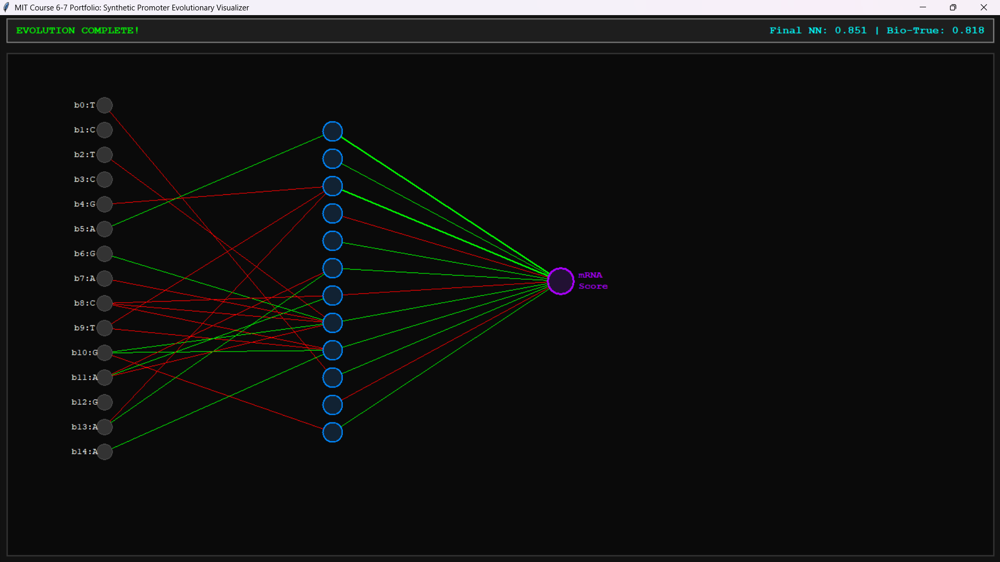

# Synthetic Promoter Neuro-Evolutionary Visualizer

An end-to-end computational biology framework built completely from scratch (without deep learning libraries like PyTorch or TensorFlow) to design optimized synthetic biological promoters using a hybrid paradigm of **Multilayer Perceptrons (MLPs)** and **Evolutionary/Genetic Algorithms (GAs)**. 

The repository features a real-time Tkinter-based graphical user interface (GUI) that dynamically visualizes synaptic weight adjustments and the convergence of functional DNA sequences across generations.

---

##  Visualizer Interface

When you execute the framework, the system renders a real-time visualization of the neural network's architecture alongside the top-performing synthetic DNA sequence of that current generation:

<!-- Replace the placeholder below with your saved image path after pushing to GitHub -->


*   **Green Synapses:** Represent positive weight values (upregulating transcription factor binding effects).
*   **Red Synapses:** Represent negative weight values (repressing transcription factor binding effects).
*   **Line Thickness:** Scaled proportionally to the absolute magnitude of the weight $\vert{}W\vert{}$, showing real-time synaptic plasticity as the model trains.

---

##  Biological Modeling Architecture

The system models a synthetic promoter design task over a core sequence length of $L=20$ base pairs.

### 1. In Silico Sequence Generation & Oracle Scoring
The biological dataset generator acts as an artificial *in silico* transcription assay oracle. It assigns expression kinetics scores based on classical promoter motifs:
*   **TATA-Box Motif:** Looks for core `"TATA"` strings, applying a penalty/bonus matrix dependent on its positional relative index to simulate distance-to-transcription-start-site (TSS) thermodynamics.
*   **GC Content Balancing:** Optimal transcription rates are set within $40\% - 60\%$. Deviations incur metabolic destabilization penalties.
*   **Poly-G Silencing:** Represses transcription if structural G-quadruplex structures (`"GGGG"`) are detected.

### 2. Biological Encoding (One-Hot Encoded Tensors)
To feed categorical genomic sequences into the matrix engine, each nucleotide character $B \in \{A, C, G, T\}$ is mapped to a sparse 4-dimensional vector:
$$A \rightarrow [1,0,0,0], \quad C \rightarrow [0,1,0,0], \quad G \rightarrow [0,0,1,0], \quad T \rightarrow [0,0,0,1]$$
A full sequence of length $L=20$ yields a flattened input matrix tensor of shape $(1, 80)$.

---

##  Mathematical Engine & Core Mechanics

The underlying deep learning pipeline is compiled strictly via matrix operations using `NumPy` to showcase explicit implementation of backpropagation algorithms.

### 1. Forward Propagation Equations
Input data $X$ transitions through an $80 \rightarrow 32 \rightarrow 1$ fully-connected architecture:

1. **Hidden Layer Linear Combination:**
   $$Z_1 = X \cdot W_1 + b_1$$
   *Where $W_1 \in \mathbb{R}^{80 \times 32}$ and $b_1 \in \mathbb{R}^{1 \times 32}$.*

2. **Rectified Linear Activation (ReLU):** Emulates biological "all-or-none" neural firing thresholds:
   $$A_1 = \max(0, Z_1)$$

3. **Output Layer Linear Combination:**
   $$Z_2 = A_1 \cdot W_2 + b_2$$
   *Where $W_2 \in \mathbb{R}^{32 \times 1}$ and $b_2 \in \mathbb{R}^{1 \times 1}$.*

4. **Sigmoid Normalization:** Compresses the abstract kinetic value into a fractional transcriptional expression coefficient:
   $$A_2 = \sigma(Z_2) = \frac{1}{1 + e^{-Z_2}}$$

---

### 2. Manual Backpropagation (Analytical Gradients via Chain Rule)
To update network synapses without an autograd engine, the system tracks loss using Mean Squared Error (MSE):
$$Loss = \frac{1}{m} \sum_{i=1}^{m} (A_2^{(i)} - y^{(i)})^2$$

Applying the mathematical **Chain Rule**, analytical gradients are derived as follows:

*   **Output Layer Error Gradient:**
    $$dZ_2 = (A_2 - y) \odot \sigma'(Z_2) = (A_2 - y) \odot (A_2 \odot (1 - A_2))$$
*   **Hidden-to-Output Synaptic Gradients:**
    $$dW_2 = \frac{1}{m} A_1^T \cdot dZ_2, \quad db_2 = \frac{1}{m} \sum_{i=1}^{m} dZ_2$$
*   **Hidden Layer Error Gradient (Backpropagated through ReLU non-linearity):**
    $$dZ_1 = (dZ_2 \cdot W_2^T) \odot f'(Z_1) \quad \text{where } f'(Z_1) = \begin{cases} 1 & \text{if } Z_1 > 0 \\ 0 & \text{if } Z_1 \le 0 \end{cases}$$
*   **Input-to-Hidden Synaptic Gradients:**
    $$dW_1 = \frac{1}{m} X^T \cdot dZ_1, \quad db_1 = \frac{1}{m} \sum_{i=1}^{m} dZ_1$$

### 3. Gradient Descent Optimization
Weights and biases are updated downstream using a constant stochastic learning rate parameter $\alpha$:
$$W_1 \leftarrow W_1 - \alpha \cdot dW_1, \quad b_1 \leftarrow b_1 - \alpha \cdot db_1$$
$$W_2 \leftarrow W_2 - \alpha \cdot dW_2, \quad b_2 \leftarrow b_2 - \alpha \cdot db_2$$

---

### 4. Evolutionary Algorithm Optimization (Genetic Operators)
Once trained, the Neural Network acts as the *Fitness Function Evaluation Engine* for an evolutionary simulation aimed at optimizing autonomous synthetic sequence generation.

*   **Stochastic Roulette Wheel Selection:** The probability $P_i$ of a specific sequence $i$ surviving to form the parental mating pool is relative to its predicted transcriptional performance:
    $$P_i = \frac{\text{Prediction}_i}{\sum_{j=1}^{\text{pop\_size}} \text{Prediction}_j}$$
*   **Single-Point Crossover:** Simulates meiotic genetic recombination at a random locus break-point $k$:
    $$\text{Child}_1 = \text{Parent}_1[0:k] + \text{Parent}_2[k:L]$$
*   **Stochastic Base Mutation:** Simulates radiation or replication errors at a specified rate ($\mu = 0.05$). If triggered, a base is substituted for a non-identical alternative base vector:
    $$B_{random} \in \{b \in \{A,C,G,T\} \mid b \neq B_{current}\}$$

---

## 🛠️ File Structure & Execution

Ensure all script components are preserved inside the same functional path subdirectory:

```text
├── data_generator.py     # Functional synthetic biological dataset engine
├── neural_network.py     # NumPy multi-layer perceptron with analytical gradients
├── main.py               # Tkinter GUI visualizer and background thread orchestration
└── README.md             # Core technical documentation
